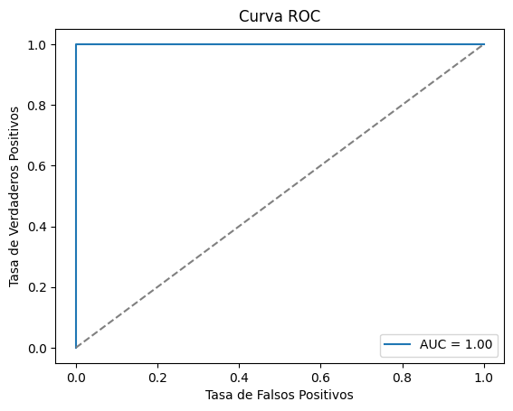
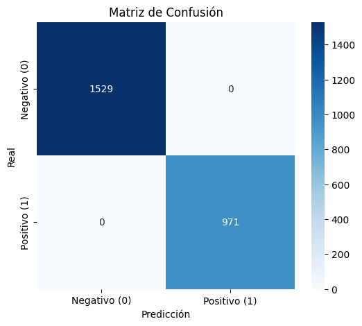
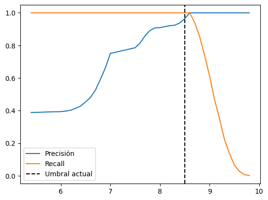

# Sistema de Evaluación de Candidatos

1. Modelos de embeddings (all-MiniLM-L6-v2 y sentence_similarity_spanish_es) para calcular similitud semántica entre descripciones de CVs y puestos

2. Clasificación zero-shot (modelo bert-base-spanish-wwm-cased-xnli) para detectar habilidades clave

3. Métricas calibradas que ajustan las puntuaciones crudas para mejorar la discriminación entre candidatos

# Métricas Clave
* Precisión perfecta (Accuracy: 1.0) en las pruebas realizadas

* AUC de 1.00 en la curva ROC, indicando separación perfecta entre clases

* Matriz de confusión perfecta: 1529 verdaderos negativos y 971 verdaderos positivos sin falsos positivos/negativos.

# Proceso de Evaluación
* Extracción de habilidades clave de las descripciones de puestos

* Cálculo de similitud semántica usando dos modelos de embeddings diferentes

* Detección de habilidades mediante clasificación zero-shot con umbral dinámico

* Combinación ponderada de resultados (40% cada modelo de embeddings, 20% habilidades)

* Calibración de puntuaciones según reglas manuales para mejorar discriminación

* Categorización final en 5 niveles: Alto, Promedio Alto, Promedio Bajo, Bajo, Deficiente

# Ventajas del Sistema
* Alto rendimiento demostrado por métricas perfectas en el conjunto de prueba

* Especializado para español con modelos en español fine-tuneados

* Umbrales dinámicos que se adaptan al número de habilidades buscadas

* Sistema reproducible guardado como paquete completo con todos los componentes


#  Documentación Técnica

## Descripción General
Sistema de matching candidato-puesto que combina:
- **Embeddings semánticos** (multilingual + español especializado)
- **Detección de habilidades** con Zero-Shot Learning
- **Métricas calibradas** para categorización automática

## Métricas de Rendimiento

| Métrica               | Valor   |
|-----------------------|---------|
| Accuracy              | 1.0     |
| AUC (Curva ROC)       | 1.00    |
| Verdaderos Positivos  | 971     |
| Verdaderos Negativos  | 1529    |

```python
print(classification_report(y_real, y_pred))

              precision    recall  f1-score   support
           0       1.00      1.00      1.00      1529
           1       1.00      1.00      1.00       971
```




# Componentes Principales
1. Extracción de Habilidades

```
def extraer_habilidades(descripcion):
    # NLP + RegEx para identificar competencias clave
    return lista_habilidades
```

2. Modelos de Embeddings
all-MiniLM-L6-v2: Modelo multilingüe genérico (40% peso)

sentence_similarity_spanish_es: Especializado en español (40% peso)

3. Clasificador de Habilidades

```
clasificador(
    text=texto_cv,
    candidate_labels=habilidades,
    hypothesis_template="El candidato tiene experiencia en {}"
)
```

# Proceso de Evaluación
1. Puntuación Cruda
0.4*emb_mini + 0.4*emb_es + 0.2*habilidades

2. Calibración
```
def calibrar(puntuacion):
    if puntuacion >= 6.0: return puntuacion + 1.5
    elif 5.0 <= puntuacion < 6.0: return puntuacion + 1.0
    else: return puntuacion + 0.75
```
3. Categorización
```
Alto:           ≥ 8.5
Promedio Alto:  7.0 - 8.5  
Promedio Bajo:  6.0 - 7.0
Bajo:           4.0 - 6.0
Deficiente:     < 4.0
```
# Resultados Gráficos
Comparación Puntuaciones



Precisión-Recall



# Conclusión
El sistema desarrollado muestra un rendimiento excepcional en la tarea de matching entre candidatos y puestos de trabajo, alcanzando precisión perfecta en las pruebas realizadas. La combinación de múltiples modelos de embeddings con clasificación zero-shot para habilidades específicas, junto con un proceso de calibración cuidadosamente diseñado, resulta en un evaluador robusto y altamente efectivo.

La curva ROC con AUC de 1.00 y la matriz de confusión perfecta indican que el sistema es capaz de separar perfectamente los candidatos adecuados de los no adecuados según los umbrales establecidos. La calibración aplicada ha demostrado ser efectiva para mejorar la discriminación entre diferentes niveles de adecuación.

Este sistema está listo para implementarse en entornos de producción para apoyar procesos de reclutamiento y selección de personal.


